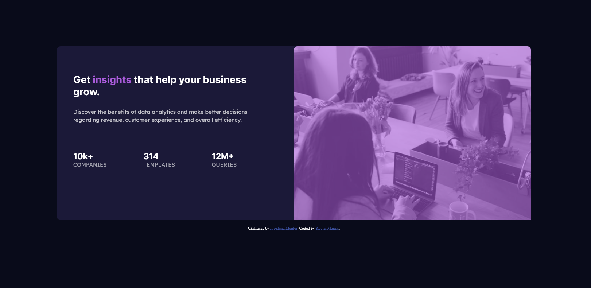

# Frontend Mentor - Order summary card solution

This is a solution to the [Order summary card challenge on Frontend Mentor](https://www.frontendmentor.io/challenges/order-summary-component-QlPmajDUj). Frontend Mentor challenges help you improve your coding skills by building realistic projects. 

## Table of contents

- [Overview](#overview)
  - [The challenge](#the-challenge)
  - [Screenshot](#screenshot)
  - [Links](#links)
- [My process](#my-process)
  - [Built with](#built-with)
  - [What I learned](#what-i-learned)
  - [Continued development](#continued-development)  
- [Author](#author)

## Overview

### The challenge

Users should be able to:

- View the optimal layout depending on their device's screen size

### Screenshot

### Links

- Live Site URL: [Stats preview card component](https://kevynsm.github.io/Stats-preview-card-component/)

## My process

### Built with

- Semantic HTML5 markup
- CSS custom properties
- Flexbox
- Media Queries

### What I learned

I used this project to practice my HTML and CSS skills, focusing mainly on Flexbox and Media Queries. 

### Continued development

It was my second frontend project and I still have a lot to learning about FlexBox and Media Queries, so for my next project I'm going to keep practicing these concepts.

## Author

- Frontend Mentor - [@KevynSM](https://www.frontendmentor.io/profile/KevynSM)
